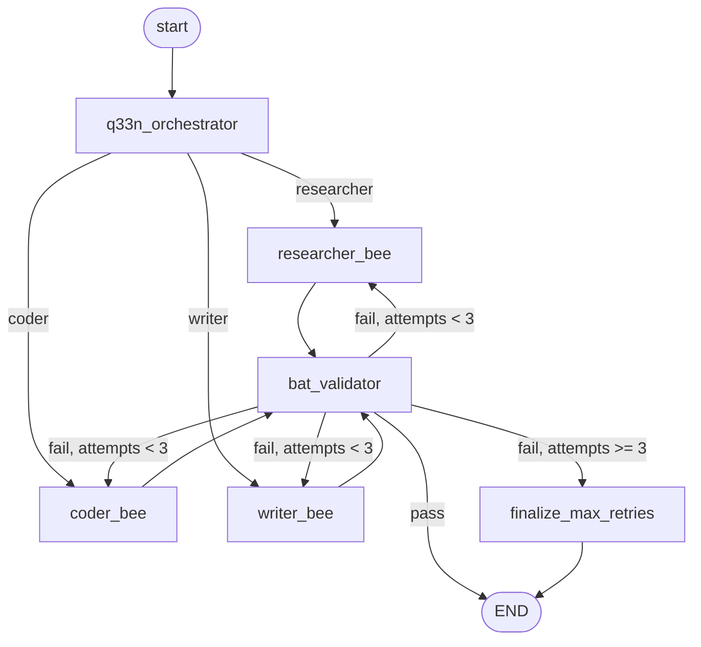

# hive-langgraph

A small multi-agent orchestration loop (orchestrator, three workers, acceptance tester) built on LangGraph.

## Why this exists

This is a simplified, public port of my proprietary multi-agent framework (Hive) onto LangGraph. It exists as a reference implementation and as a public demonstration of LangGraph-based orchestration patterns.

The goal is to show one clean, runnable example of:

- conditional routing from an orchestrator to specialized worker nodes,
- a validator node that loops failed work back to the worker with feedback,
- a retry cap that lets the graph terminate gracefully,
- a bring-your-own-LLM layer that swaps providers via env var.

## Architecture

The graph has three role types, each one LangGraph node:

- **Q33N** (orchestrator): reads the incoming spec, classifies it (researcher / coder / writer), and routes to the matching worker.
- **Worker bees** — `researcher_bee`, `coder_bee`, `writer_bee`: one LLM-backed node per output type. The worker reads the spec plus any prior BAT feedback and produces an answer.
- **BAT** (acceptance tester, "build acceptance test"): a second LLM-backed node that validates the worker's output against the spec's acceptance criteria and emits a structured `pass` / `fail` verdict with reasoning.

The diagram below is rendered with [Mermaid](https://mermaid.js.org/) (which GitHub renders natively inside fenced ` ```mermaid ` blocks). Arrows are LangGraph edges; labels on the BAT edges are the conditional-edge values.



The loop: Q33N picks one worker. The worker writes to `state.worker_output`. BAT reads the output plus the acceptance criteria and decides. On `fail`, BAT writes its reasoning into `state.bat_feedback` and the graph routes back to the *same* worker for another attempt (the worker sees the prior feedback in its next prompt). On `pass`, or after three failed attempts, the graph ends.

## Quick start

```bash
git clone https://github.com/daaaave-atx/hive-langgraph.git
cd hive-langgraph
python -m venv .venv && .venv\Scripts\activate && pip install -r requirements.txt
copy .env.example .env  # then edit .env to add your ANTHROPIC_API_KEY
python -m hive_lg.demo --spec-id 2
```

## BYOLLM

The model is selected by the `HIVE_LG_PROVIDER` env var: `anthropic` (default) or `ollama`. Anthropic uses `langchain_anthropic.ChatAnthropic` with the current Sonnet model; Ollama uses `langchain_ollama.ChatOllama` against your local server. See `.env.example`.

## What is simplified vs. the real Hive

This public reference intentionally drops the production concerns of the proprietary framework:

- no persistence or event ledger; each run is fresh in memory,
- no governance enforcement (ethics, carbon, grace budgets),
- no real concurrency; nodes execute serially in the graph,
- no surrogate models,
- no speculative branching across alternate execution paths,
- single tier of workers; no nested orchestration or subgraphs.

What stays is the shape: orchestrator, typed workers, a validator that closes the loop, and a retry cap.

## License

MIT. See [LICENSE](LICENSE).
